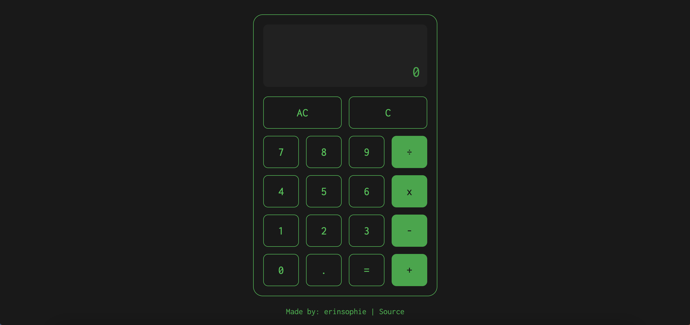

# Calculator 

## [Live Demo](https://erinsophie.github.io/calculator/)

# Technologies Used 

- HTML
- CSS
- Javascript

# Project goals

- If result has more than 10 digits before the decimal place, convert to exponential notation with a precision of 6 decimal places
- Otherwise reduce any other result that is under that threshold but includes a decimal place to 2 decimal places 
- If there is no decimal in the result then display the result as normal